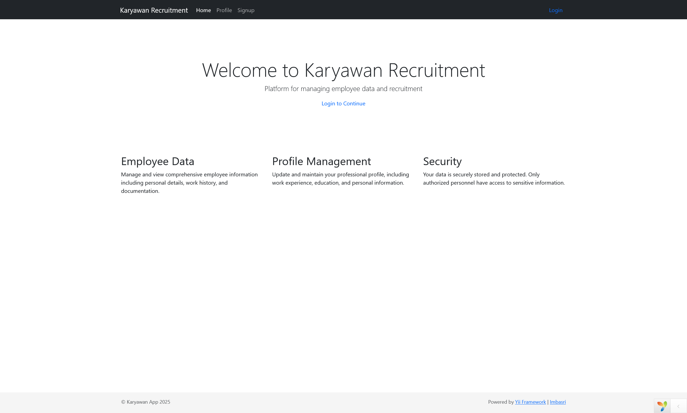

## Karyawan App

<p align="left">
    
    
</p>

Karyawan App adalah aplikasi berbasis web yang dikembangkan menggunakan Yii 2 Advanced Project Template. Aplikasi ini dirancang untuk mengelola data karyawan dengan berbagai fitur yang memudahkan pengelolaan dan pemantauan ada beberapa role admin dan user untuk membuat data karyawan.

### Demo

#### Gambar
<p align="center">
    
</p>

#### Video

https://github.com/user-attachments/assets/eef70fce-7663-4550-9b2a-a686d0777c81

jika video error buka di folder demo

### Cara Clone dan Menjalankan Project sebagai Developer

1. **Clone Repository**
    ```sh
    git clone https://github.com/username/karyawan-app.git
    cd karyawan-app
    ```

2. **Install Dependencies**
    ```sh
    composer install
    ```

3. **Setup Environment**
    Salin file `.env.example` menjadi `.env` dan sesuaikan konfigurasi sesuai dengan lingkungan pengembangan Anda.

4. **Setup Database**
    Buat database baru dan sesuaikan konfigurasi database di file `common/config/main-local.php`.

5. **Migrate Database**
    ```sh
    php yii migrate
    ```

6. **Setup Permissions**
    Pastikan direktori `runtime` dan `web/assets` dapat ditulisi oleh web server.
    ```sh
    chmod -R 777 frontend/runtime
    chmod -R 777 frontend/web/assets
    ```

7. **Start Development Server**
    ```sh
    php yii serve or php yii serve --docroot="frontend/web"
    ```

    Jangan lupa untuk menjalankan webserver Apache atau Nginx serta database yang anda gunakan di settingan main-local.php.

8. **Akses Aplikasi**
    Buka browser dan akses aplikasi melalui URL `http://localhost:8080`.

### Struktur Direktori

- `common`: Konfigurasi dan file yang digunakan bersama oleh aplikasi front end dan back end.
- `console`: Aplikasi console untuk menjalankan perintah-perintah Yii.
- `environments`: Konfigurasi lingkungan yang berbeda.
- `frontend`: Aplikasi front end.


